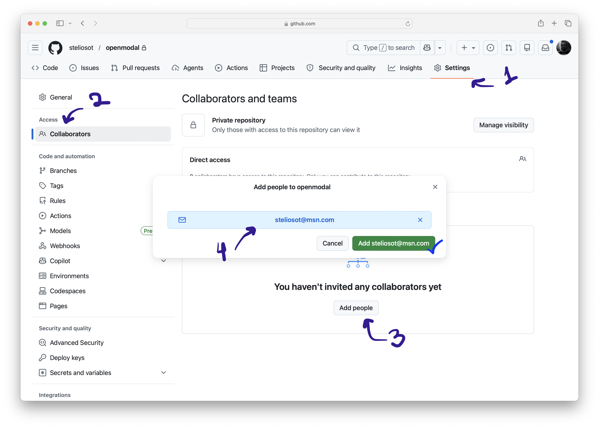

# Phase 07: Submit your work (10 minutes)

## Goal

Push your completed work to your forked GitHub repository and share it with Stelios.

## Steps

1. Check your local changes.
2. Commit your completed work.
3. Push your work to your forked repository.
4. Open your fork on GitHub.
5. Share the GitHub repository link with Stelios.
6. Add Stelios as a collaborator on your GitHub fork.

## Check your work

Run:

```bash
git status
```

Review the files that changed.

## Commit your work

```bash
git add .
git commit -m "Complete capstone activity"
```

## Push to your fork

```bash
git push
```

Your work should now be visible in your forked GitHub repository.

## Share your repository

Copy the GitHub link for your forked repository and share it with Stelios at `steliosot@msn.com`.

Add `steliosot@msn.com` as a collaborator on your GitHub fork.

Use the screenshot below as a guide:


*Figure 1: Add Stelios as a collaborator on your GitHub fork.*

## Checkpoint

Confirm that:

- Your latest code appears in your GitHub fork.
- Your `reports/sequential_report.md` file appears in your GitHub fork.
- Your downloaded videos are not committed.
- You shared the GitHub repository link with Stelios at `steliosot@msn.com`.

Congratulations, you completed the capstone project. Well done!
