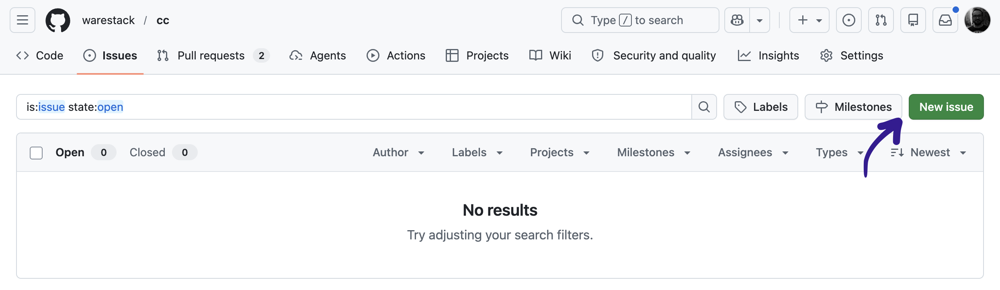
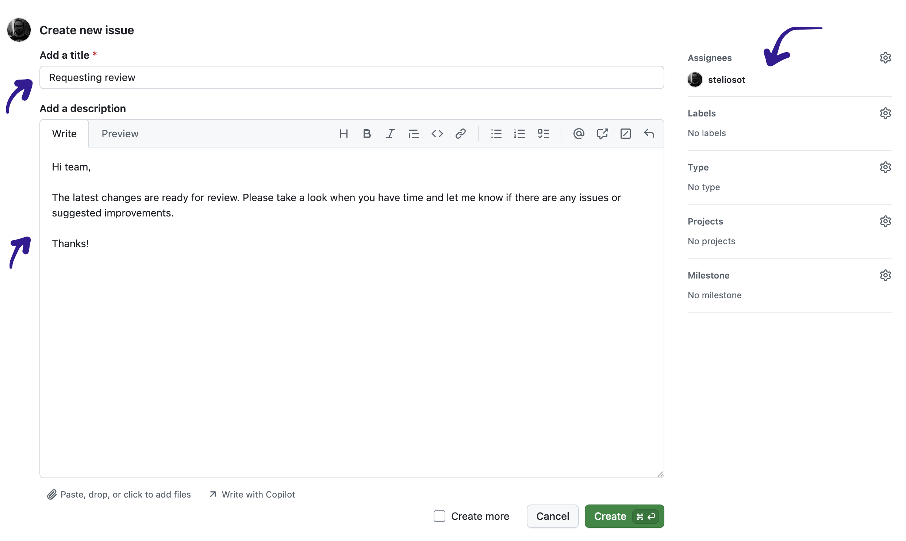

# Phase 10: Request feedback (lab extension)

## Goal

Push your latest lab changes to your forked GitHub repository and create a GitHub issue asking Stelios for feedback.

## Steps

1. Check your local changes.
2. Commit your latest work.
3. Push your changes to your forked repository.
4. Create a new GitHub issue in your fork.
5. Assign the issue to `steliosot@msn.com`.
6. Write a short request for feedback.

## Commit your latest work

Run:

```bash
git status
```

Review the files that changed.

Then commit your work:

```bash
git add .
git commit -m "Complete lab extensions"
git push
```

## Create a GitHub issue

Open your forked repository on GitHub.

Then:

1. Click the **Issues** tab.
2. Click **New issue**.
3. Add a clear title.
4. Write a short message asking for feedback.
5. Assign the issue to `steliosot@msn.com`.
6. Click **Submit new issue**.

If GitHub does not show the email address in the assignee search, search for the Stelios GitHub account connected to that email.

Use the screenshots below as a guide:


*Figure 1: Click **New issue** from the Issues tab.*


*Figure 2: Add a title, write a short request for feedback, and assign the issue to Stelios.*

## Example issue title

```text
Feedback request for capstone lab extension
```

## Example issue message

```text
Hi Stelios,

I completed the capstone lab extensions.

I would like feedback on:

- my metadata extraction function
- my error handling
- my report structure
- whether my GitHub repo is organised clearly

Thank you.
```

## Checkpoint

Confirm that:

- Your latest code is pushed to your GitHub fork.
- Your `data/video_metadata.csv` file appears in your GitHub fork if you created it.
- Your `reports/sequential_report.md` file appears in your GitHub fork.
- You created a GitHub issue asking for feedback.
- The issue is assigned to `steliosot@msn.com`.
